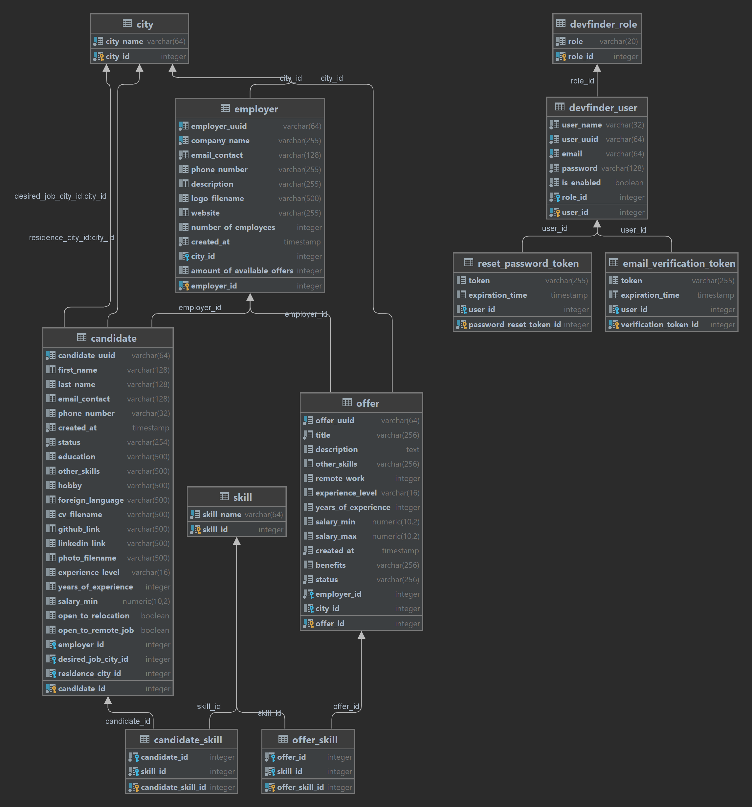

# Devfinder - Recruitment Platform

Welcome to the Recruitment Platform! This is a web application designed to connect employers with skilled programmers
seeking new opportunities.

## Features

### For All

- You can browse job offers, list of employers and use job analysis from one of the largest portals justjoin.it

### For Employers

- Create an account to represent your company on the platform.
- Browse candidate profiles based on your criteria.
- Mark candidates as hired to indicate their availability status.
- Post job offers to attract potential candidates directly to your open positions.

### For Candidates

- Create a profile to showcase your skills and experience.
- Upload your photo to personalize your profile.
- Search for companies seeking candidates like you.
- Mark your profile as "inactive" if not actively looking for new opportunities.
- Explore job offers posted by employers.

## Getting Started
Clone repository

```
git clone https://github.com/WaldemarGoszka/DevFinder_0.git
```

##### Intellij
Create PostgreSQL database
```
name: "devfinder", password: postgres
```
run in webbrowser:
```
http://localhost:8080/devfinder
```
#### Docker
you have docker in your computer you can run application in container, run this commends in CMD:  
first install postgres database:
```
docker pull postgres
```
second run application:
```
gradle build
```
```
docker build -t devfinder/devfinder:1.0 .
```
```
docker compose up -d
```
wait a moment and enter
```
http://localhost:8080/devfinder
```
### Data for testing
You can use your login credentials to test this application or create your own account
```
employers:

email: kontakt@abccorp.com password:test
email: info@xyztech.com password:test

candidates:

email: jan.kowalski@example.com password:test
email: anna.nowak@example.com password:test
```

## Description

### Content available without registration

Without registration, we get access to 3 sites that search for candidates, employers and employer offers.
On each page we are shown tables of results. By default, the results are sorted and paginated. We are given how many
results were returned. We can change the number of items per page (default is 5) from 5,10,50. We can change pages by
clicking on the page number or Next, Previous buttons. We can change the column by which the results are sorted by
clicking on the column head, the columns by which we can sort are red. We can change the direction of sorting by
clicking again on the same column, The direction of sorting can be seen by a white strap line which changes according to
the direction of sorting, I used font-awesome and JavaScript functions for this.

Filters take into account many parameters. They were written using Criteria Api. Here you can select multiple fields at
once and they will all be taken into account when searching. I think few job platforms have such advanced search.

A great convenience when filtering results is that the page, after reloading, remembers and selects the buttons by which the results are filtered

All sorting as well as filtering parameters are included in param
url ```http://localhost:8080/devfinder/offers?city=Warszawa&employer=ABC+Sp.+z+o.o.&salaryMin=&pageSize=5&pageNumber=1&sortBy=title&sortDirection=ASC#```.

Offers as well as candidates can have INACTIVE, EMPLOYED or EXPIRED status, the line of such result is displayed in
darker font. We can also filter them to not be displayed.

We can go into the details of each offer, candidate or employee. When entering the details of an employer, we have links
leading to offers issued by that employer. Entering the details of the offer we have links to the details of the
employer and links to other offers issued by this employer.


### Registration

Aplication allows you to register two types of user. You can register as a "Candidate" or as an "Employer".
After registration, the application can send an email from ```devfinder.service@gmail.com``` to the email provided at
registration. For testing purposes and to speed up testing of the application, the option to send verification email is
disabled. It can be enabled by changing the flag to true in the aplication.yaml file in the
```devfinder-conf.enable-email-verification``` option
When the option to send an email is enabled after registration, an email with an activation link is sent, the link
contains a verified
token ```http://localhost:8080/devfinder/register/verify_email?token=247b2acf-66af-408c-a2f2-2050addf4c80```. This token
is active for 10 minutes (this can be changed in the TokenExpirationTime class).
The token is stored in the database along with the user and registration time information in the
```email_varification_token``` column. Only when the user clicks on the activation link, it checks if the token is valid
for
the user and toggles the ```isEnabled``` flag to true in the User object which means that the user has been verified and
only
now can log in.
When the email option is disabled, the email with the verification link is not sent and the isEnabled flag is
immediately switched to true and the user can log in immediately

### Forgot Password

If you forget your password, the application allows you to set a new password. We only need to know our email address
that we used when registering for the account. We send the form with the email and we get an email from
```devfinder.service@gmail.com``` along with an email in which there is a link to reset the password which contains an
wtgenerated token which is stored in the database in the ```reset_password_token```
column (```http://localhost:8080/devfinder/register/password_reset_form?token=e3039f53-8297-4a64-8782-0689f7fce14e```)
the
link contains a token which leads us to the password change form where we enter the new password. Now we can log in with
the new password

### Candidate Portal

The candidate portal allows you to create your own profile for employers to view. We can enter all of our details from
personal information to hobbies .We have the ability to select our skills, years of experience, experience level,
education, whether we are open to working remotely, links to github and linkedin and minimum expected payout. We have
the option to add a .jpeg photo and a resume/cv .pdf file, and we can set ACTIVE or INACTIVE status. We cannot set
EMPLOYED status because only the employer can do that. When we have EMPLOYED status we also cannot change our status,
only the employer can do that by firing us.
We have the ability to edit our profile at any time to remove our photo, cv or entire profile. In order for our profile
not to be in the search results, we have to delete the entire profile.
When creating a profile is created

### Employer Portal

The employer has the ability to issue new offers and edit existing ones and delete them. He also has the ability to hire
candidates
In order to add a new job offer, the employer first needs to fill out his profile, in which he provides basic data, he
also has the option of adding a company logo. The company profile shows the number of active job offers. Issuing a new
job offer. We have the opportunity to provide basic information about the candidate we are looking for, as well as the
skills that the candidate should have. We can specify the percentage of remote work, where 0% means work in the office
and 100% means fully remote work, we can specify the salary range and benefits at work.
The employer has the ability to hire employees. In order to hire an employee he must have an ACTIVE status. Employed
candidates are in the "Employee" tab, you can dismiss an employee at any time by entering one datails

### User Settings

It is possible to change your password in the Settings tab. Both the candidate and the employer can delete his account
completely, which will block the possibility of logging in to it. All data will be deleted, to return to the portal
again must re-register .

### REST API

Postman collection to test all endpoints below is in Postman ```Devfinder_Postman _export.json``` file

#### GET Content available without registration

##### ```api/employers``` endpoint
Employer List
```
http://localhost:8080/devfinder/api/employers  
 
http://localhost:8080/devfinder/api/employers?skillsInOffers=PostgreSQL&city=Warszawa&jobOffersStatus=hasJobOffers&jobOffersStatus=hasNoJobOffers&pageSize=5&pageNumber=1&sortBy=amountOfAvailableOffers&sortDirection=DESC#
```
available params at ```api/employers``` endpoint:
```
city  
companyName  
skillsInOffers
amountOfAvailableOffers  
numberOfEmployees  
jobOffersStatus []  

pageNumber {default 1}  
pageSize {default 5}  
sortDirection {default DESC}  
sortBy {default amountOfAvailableOffers}  
```
available param values ```skillsInOffers```
```
"Python"
"JavaScript"
"C++"
"SQL"
"HTML"
"CSS"
"PHP"
"Ruby"
"Swift"
"Go"
"Kotlin"
"React"
"Angular"
"Vue.js"
"Node.js"
"Docker"
"Git"
"AWS"
"Machine Learning"
"Data Science"
"Ruby on Rails"
"ASP.NET"
"Laravel"
"Spring Framework"
"Express.js"
"MongoDB"
"PostgreSQL"
"Firebase"
"Elasticsearch"
"GraphQL"
"AWS Lambda"
"Azure"
"Google Cloud Platform"
"DevOps"
"Scrum"
"Kubernetes"
"Microservices"
"RESTful API"
"Test Driven Development"
"Agile Project Management"
"Spring Boot"
"Hibernate"
"JavaFX"
"JPA"
"JUnit"
"Maven"
"Gradle"
```
available param values  ```jobOffersStatus```
```
hasJobOffers  
hasNoJobOffers  
```
available param values ```sortDirection```
```
ASC  
DESC
```
available param values ```sortBy```
```
companyName
city
amountOfAvailableOffers
numberOfEmployees
```
##### ```api/employer/{employerId}``` endpoint
```
http://localhost:8080/devfinder/api/employer/1
```


##### ```api/candidates``` endpoint
Candidates List
```
http://localhost:8080/devfinder/api/candidates 
 
http://localhost:8080/devfinder/api/candidates?status=ACTIVE&status=INACTIVE&status=EMPLOYED&experienceLevels=JUNIOR&experienceLevels=MID&experienceLevels=SENIOR&minYearsOfExperience=1&city=Warszawa&openToRemoteJob=YES&openToRemoteJob=NO&salaryMax=&pageSize=5&sortBy=lastName&sortDirection=ASC#
```
available params at ```api/candidates``` endpoint:
```
status []
experienceLevels []
skills []
minYearsOfExperience
city
openToRemoteJob []
salaryMax
employer

pageNumber {default 1}  
pageSize {default 5}  
sortDirection {default ASC}  
sortBy {default lastName}  
```

available param values ```status```
```
ACTIVE
INACTIVE
EMPLOYED
```
available param values ```experienceLevels```
```
JUNIOR
MID
SENIOR
```
available param values ```skills```
```
as in the previous endpoint
```
available param values ```openToRemoteJob```
```
YES
NO
```
available param values ```sortBy```
```
lastName  
experienceLevel  
yearsOfExperience
residenceCityId.cityName
salaryMin
```

##### ```api/candidate/{candidateId}``` endpoint
```
http://localhost:8080/devfinder/api/candidate/1
```

##### ```api/offers``` endpoint
Offers List
```
http://localhost:8080/devfinder/api/offers
 
http://localhost:8080/devfinder/api/offers?status=ACTIVE&status=EXPIRED&experienceLevels=JUNIOR&experienceLevels=MID&experienceLevels=SENIOR&skills=Node.js&city=Wroc%C5%82aw&employer=&remoteWork=FULL&remoteWork=PARTLY&remoteWork=OFFICE&salary=WITH&salary=UNDISCLOSED&salaryMin=3000&pageSize=5&sortBy=createdAt&sortDirection=DESC#
```
available params at ```api/offers``` endpoint:
```
experienceLevels []
remoteWork []
salaryMin
salary []
status []
city
employer
skills []

pageNumber {default 1}  
pageSize {default 5}  
sortDirection {default DESC}  
sortBy {default createdAt}  
```

available param values ```remoteWork```
```
FULL
PARTLY
OFFICE
```
available param values ```salary```
```
WITH
UNDISCLOSED
```
available param values ```status```
```
ACTIVE
EXPIRED
```
available param values ```skills```
```
as in the previous endpoint
```
available param values ```sortBy```
```
title 
experienceLevel  
employerId.companyName
cityId.cityName
remoteWork
salaryMin
createdAt
```

#### POST User Registration
available Role:
```
CANDIDATE
EMPLOYER
```
Request:
curl:
```
curl --location 'http://localhost:8080/devfinder/api/register/register_page' \
--header 'Content-Type: application/json' \
--data-raw '{
    "userName": "John5",
    "email": "john@example.com5",
    "password": "test",
    "role": "CANDIDATE"
}'
```
```
POST http://localhost:8080/devfinder/api/register/register_page
```
example body:
```
{
    "userName": "John",
    "email": "john@example.com",
    "password": "test",
    "role": "CANDIDATE"
}
```
Response:
```
{
    "id": 59,
    "userName": "John",
    "userUuid": "dc8beaa6-0bb5-409b-9cc9-5ede08050125",
    "email": "john@example.com",
    "password": "$2a$10$2lc1RQ5wBeGX8.0WGJ1lKOe6Iw2Bkis6.NfGwaYQtbrUd.haZ6iZi",
    "isEnabled": true,
    "role": {
        "id": 1,
        "role": "CANDIDATE"
    }
}
```
#### POST User Login
```
POST http://localhost:8080/devfinder/login?email=john@example.com&password=test
```
```
curl --location --request POST 'http://localhost:8080/devfinder/login?email=john%40example.com&password=test' \
```
#### POST Create Candidate Profile
We can only once tą metodę i otrzymamy 201, przy ponownym dostaniemy 400 Bad Request nie jest idempotentna
```
POST http://localhost:8080/devfinder/api/candidate_portal/new_profile
```
example json body
```
{
"status": "ACTIVE",
"firstName": "Jan",
"lastName": "Kowalski",
"residenceCityName": "Warszawa",
"experienceLevel": "JUNIOR",
"yearsOfExperience": "3",
"candidateSkillsNames": 
["CSS", "Data Science", "Docker", "Express.js", "GraphQL", "JavaScript", "Kotlin"],
"education": "Mgr inż. Informatyki",
"foreignLanguage": "Angielski",
"salaryMin": "5000.00",
"openToRemoteJob": "false",
"linkedinLink": "https://linkedin.com/in/jankowalski",
"githubLink": "https://github.com/jankowalski",
"hobby": "Gra na gitarze",
"emailContact": "jan.kowalski@example.com",
"phoneNumber": "123456789"
}
```
example curl
```
curl --location 'http://localhost:8080/devfinder/api/candidate_portal/new_profile' \
--header 'Content-Type: application/json' \
--header 'Cookie: JSESSIONID=FD1EB88AAA6D24AE2F6BED98E93CBB91' \
--data-raw '{
"status": "ACTIVE",
"firstName": "Jan",
"lastName": "Kowalski",
"residenceCityName": "Warszawa",
"experienceLevel": "JUNIOR",
"yearsOfExperience": "3",
"candidateSkillsNames": 
["CSS", "Data Science", "Docker", "Express.js", "GraphQL", "JavaScript", "Kotlin"],
"education": "Mgr inż. Informatyki",
"foreignLanguage": "Angielski",
"salaryMin": "5000.00",
"openToRemoteJob": "false",
"linkedinLink": "https://linkedin.com/in/jankowalski",
"githubLink": "https://github.com/jankowalski",
"hobby": "Gra na gitarze",
"emailContact": "jan.kowalski@example.com",
"phoneNumber": "123456789"
}'
```
#### GET get Candidate Profile
```
GET http://localhost:8080/devfinder/api/candidate_portal/profile
```
curl
```
curl --location 'http://localhost:8080/devfinder/api/candidate_portal/profile' \
--header 'Cookie: JSESSIONID=5FC19CFA6FE53B8D944FF44EF681EE32'
```
example response body
```
{
    "candidateId": 34,
    "candidateUuid": "8e5f2519-72c7-492b-b80b-b04a3e1f77dc",
    "firstName": "John",
    "lastName": "Kowalski",
    "emailContact": "jan.kowalski@example.com",
    "phoneNumber": "123456789",
    "createdAt": "2023-08-17T11:23:31.454846+02:00",
    "status": "ACTIVE",
    "education": "Mgr inż. Informatyki",
    "hobby": "Gra na gitarze",
    "foreignLanguage": "Angielski",
    "githubLink": "https://github.com/jankowalski",
    "linkedinLink": "https://linkedin.com/in/jankowalski",
    "experienceLevel": "JUNIOR",
    "yearsOfExperience": 3,
    "salaryMin": 5000.00,
    "openToRemoteJob": false,
    "residenceCityId": {
        "cityId": 1,
        "cityName": "Warszawa"
    },
    "candidateSkills": [
        {
            "candidateSkillId": 219,
            "skillId": {
                "skillId": 20,
                "skillName": "Data Science"
            }
        },
        {
            "candidateSkillId": 218,
            "skillId": {
                "skillId": 30,
                "skillName": "GraphQL"
            }
        },
        {
            "candidateSkillId": 222,
            "skillId": {
                "skillId": 6,
                "skillName": "CSS"
            }
        },
        {
            "candidateSkillId": 217,
            "skillId": {
                "skillId": 16,
                "skillName": "Docker"
            }
        },
        {
            "candidateSkillId": 223,
            "skillId": {
                "skillId": 11,
                "skillName": "Kotlin"
            }
        },
        {
            "candidateSkillId": 220,
            "skillId": {
                "skillId": 2,
                "skillName": "JavaScript"
            }
        },
        {
            "candidateSkillId": 221,
            "skillId": {
                "skillId": 25,
                "skillName": "Express.js"
            }
        }
    ]
}
```
#### PUT Update Candidate Profile
```
PUT http://localhost:8080/devfinder/api/candidate_portal/update_profile
```
example body
```
{
"status": "ACTIVE",
"firstName": "Marek",
"lastName": "Nowak",
"residenceCityName": "Warszawa",
"experienceLevel": "JUNIOR",
"yearsOfExperience": "3",
"candidateSkillsNames": 
["CSS", "Data Science", "Docker", "Express.js", "GraphQL", "JavaScript", "Kotlin"],
"education": "Mgr inż. Informatyki",
"foreignLanguage": "Angielski",
"salaryMin": "5000.00",
"openToRemoteJob": "false",
"linkedinLink": "https://linkedin.com/in/jankowalski",
"githubLink": "https://github.com/jankowalski",
"hobby": "Gra na gitarze",
"emailContact": "jan.kowalski@example.com",
"phoneNumber": "123456789"
}
```
example cURL
```
curl --location --request PUT 'http://localhost:8080/devfinder/api/candidate_portal/update_profile' \
--header 'Content-Type: application/json' \
--header 'Cookie: JSESSIONID=FD1EB88AAA6D24AE2F6BED98E93CBB91' \
--data-raw '{
"status": "ACTIVE",
"firstName": "Marek",
"lastName": "Nowak",
"residenceCityName": "Warszawa",
"experienceLevel": "JUNIOR",
"yearsOfExperience": "3",
"candidateSkillsNames": 
["CSS", "Data Science", "Docker", "Express.js", "GraphQL", "JavaScript", "Kotlin"],
"education": "Mgr inż. Informatyki",
"foreignLanguage": "Angielski",
"salaryMin": "5000.00",
"openToRemoteJob": "false",
"linkedinLink": "https://linkedin.com/in/jankowalski",
"githubLink": "https://github.com/jankowalski",
"hobby": "Gra na gitarze",
"emailContact": "jan.kowalski@example.com",
"phoneNumber": "123456789"
}'
```

#### DELETE Delete Candidate Profile
```
DELETE http://localhost:8080/devfinder/api/candidate_portal/delete_profile
```
#### PATCH User Change Password
```
PATCH http://localhost:8080/devfinder/api/user/change-password?oldPassword=test&newPassword=test2&repeatNewPassword=test2
```
```
curl --location --request PATCH 'http://localhost:8080/devfinder/api/user/change-password?oldPassword=test&newPassword=test2&repeatNewPassword=test2' \
--header 'Content-Type: application/json' \
--header 'Cookie: JSESSIONID=BCE5CF808623500505341BA5B4DA823D' \
--data '{
    "oldPassword" : "test",
    "newPassword" : "test2",
    "repeatNewPassword" : "test2"
}'
```
#### DELETE Delete User Account
```
DELETE http://localhost:8080/devfinder/api/user/delete
```
curl
```
curl --location --request DELETE 'http://localhost:8080/devfinder/api/user/delete' \
--header 'Cookie: JSESSIONID=C917705D44896E149534573F641049E0'
```


```
http://localhost:8080/devfinder/login?email=john@example.com&password=test
```

#### POST Create/Update candidate profile

### API Consume from JustJoinIt.pl

The api from justjoin.it is non-public. It contains about 12 thousand real developer jobs and the json file is about 12MB. I had to increase the buffer limit in the WebClient configuration. This data can be used to analyze the programmer job market, the number of offers is sufficient to get reliable data.
Api does not publish the OpenApi contract so I had to manually create the classes needed to Map Json to Pojo classes. I used the Json To Pojo plugin in Intellij for this.

The basic endpoints to the api justjoinIt :
all offers
```
https://justjoin.it/api/offers
```
you can see deteils of particular offer, just add the "id" field from the above endpoint
```
{
       ...
        "id": "b-braun-cloud-engineer",
       ...
}
```
adn add into url like:
```
https://justjoin.it/api/offers/b-braun-cloud-engineer
```
#### Sharing consumed api
Endpoints with the same data also publishes my application at :
```
http://localhost:8080/devfinder/api/justjoinit_offers
```
```
http://localhost:8080/devfinder/api/justjoinit_offers/b-braun-cloud-engineer
```
The application analyzes the data extracting a range of useful data.
#### Api Analysis results
##### All offers analysis results

Endpoint prepares analysis of all job offers:
```
http://localhost:8080/devfinder/api/justjoinit_offers_analysis
```
information located at this endpoint :
```
totalOffers
skillsDistribution
experienceLevelDistribution
employmentTypeDistribution
mainTechnologyDistribution
salaryCurrencyDistribution
avgSalaryInPLNCurrencyB2BContractAccordingToExperienceDistribution
avgSalaryInPLNCurrencyPermanentContractAccordingToExperienceDistribution
offersWithSalaryRangesExperienceDistribution
availableTechnology
```
The data in the "skillsDistribution" column was filtered if a skill did not occur at least 10 times in the bids in question to reduce the size of the analyzed json.
##### Particular technology analysis
We can see that we have data like "availableTechnology" we can add the value of available technologies to the path to display an analysis of bids related to a specific main technology

example for java main tachnology
```
http://localhost:8080/devfinder/api/justjoinit_offers_analytics_particular_technology/java
```
information located at this endpoint
```
totalOffers
totalOffersInParticularTechnology
experienceInParticularDistribution
skillsInInParticularTechnologyDistribution
offersWithSalaryRangesInParticularDistribution
avgSalaryInPLNCurrencyB2BContractAccordingToExperienceInParticularTechnologyDistribution
avgSalaryInPLNCurrencyPermanentContractAccordingToExperienceInParticularTechnologyDistribution
availableTechnology
```
Interesting conclusions that can be drawn from the analysis that the 3 most common skills that appeared in all the bids were
```
"Java": 1487,
"SQL": 1233,
"English": 953
```
And the number of offers where the main technology was used :
```
"java": 1434,
"javascript": 1230,
"data": 1099,
```
Looks like java is the king :)
#### Swagger-UI / Open Api
The swagger-ui contract is available at
```
http://localhost:8080/devfinder/swagger-ui/index.html
```

## Technologies Used

- Spring Boot
- Thymeleaf
- Spring Security
- Docker Compose
- PostgreSQL
- Flyway
- Spring Data JPA
- Spring Criteria API
- REST API
- Swagger UI
- MapStruct
- JavaScript
- HTML

File transfer
Files are saved on the server in the directory defined in application.yaml devfinder-conf.user-data-path : "src/main/resources/static/user_data/"
When When saving an image to a directory, the name of the directory is changed, the user uuid is added to prevent collision of the same file name uploaded by 2 users. In addition, the hyphens "-" are replaced with underscores "_" in the uuid. When a user deletes their profile or account, the files are also deleted.

Data validation
CandidateUpdateRequestDTO, EmployerUpdateRequestDTO, OfferUpdateRequestDTO classes are used to transport data from the frontend to the backend. In them is used validation of input data so that it goes to the backend in the correct form

Mapstruct
The application uses 3 layers: data access layer, service layer and web layer. Between these layers objects are mapped with the help of mappstruct

## Database

### ERD Database Diagram



### solutions used in the data base
#### functions used in the database
The ```employer.amount_of_available_offers``` field is responsible for functions and database triggers such as
``increase_amount_of_available_offers_when_add_new()```
after insert on offer

```decrease_amount_of_available_offers_when_delete()```
after delete ON offer

```recalculate_amount_of_available_offers_after_inserts()```
when running data base

```decrease_amount_of_available_offers_when_change_active_to_expired()```
when offer status changes from ACTIVE to EXPIRED

```increase_amount_of_available_offers_when_change_expired_to_active()```
when offer status changes from EXPIRED to ACTIVE

A user in the database can have 2 roles EMPLOYER or CANDIDATE.
The user.user_uuid field is detected in the database. User is created when the user registers. Employer and candidate columns are created when the user fills out his profile, then user_uuuid is the same as employer_uuuid or candidate_uuid.

The city table is updated each time the parameter city_id is deleted, added or edited in the employer, candidate or offer tables. If a city does not exist it is added to the database. if you delete an offer, candidate or employer and no others have that city it is removed from the database.
This is implemented for better search and filtering of results, because when you select the filter you have a list of all cities used in the database, if the city is not used in any of the records, it is removed.

## Further plans
- Adding the possibility for candidates to send applications to specific offers.
- List of submitted applications for offers in the employer and hiring portal.
- Ability to observe employers and receive notifications when a particular employer adds a new offer
- Possibility to add offers to favorites section
- Mechanism of sending messages in the application
- Notification function


### Material used
For the project, I used:

Favicon.ico:
```
https://freefavicon.com/freefavicons/business/iconinfo/business-man-avatar-vector-152-185058.html
```
Bootstrap template:
```
https://themewagon.com/themes/free-bootstrap-5-admin-dashboard-template-darkpan/
```
Api:
```
https://justjoin.it/
```
DiffBlue plugin for unit test

### Unresolved issues
- Only 60% test code coverage
- In the docker container, adding photos not work correctly
- When compiling via Intellij, in order for images to load smoothly, uncomment line 61 in the FileService class. Without this, the images will load after restarting the application
